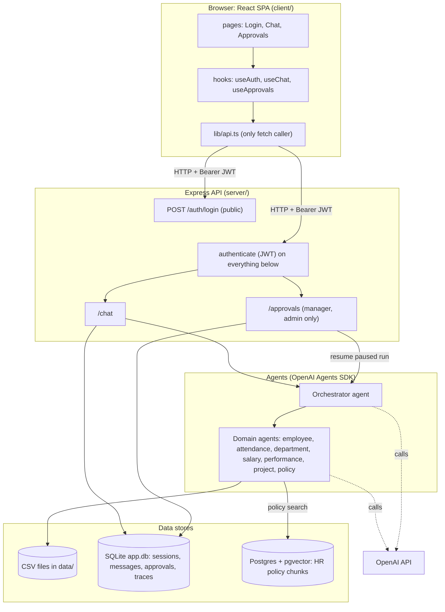
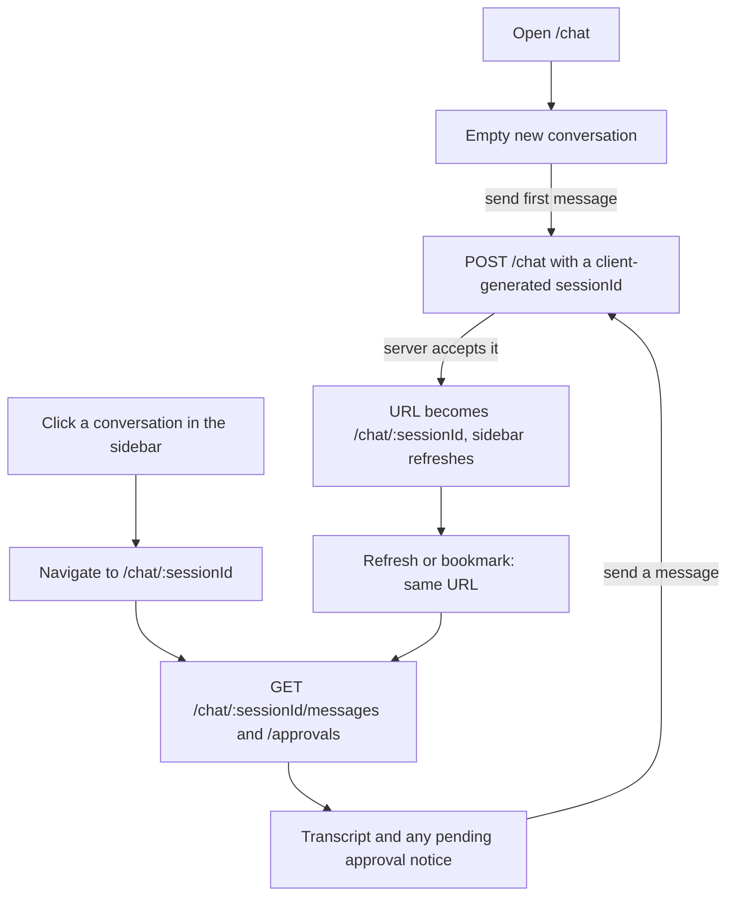
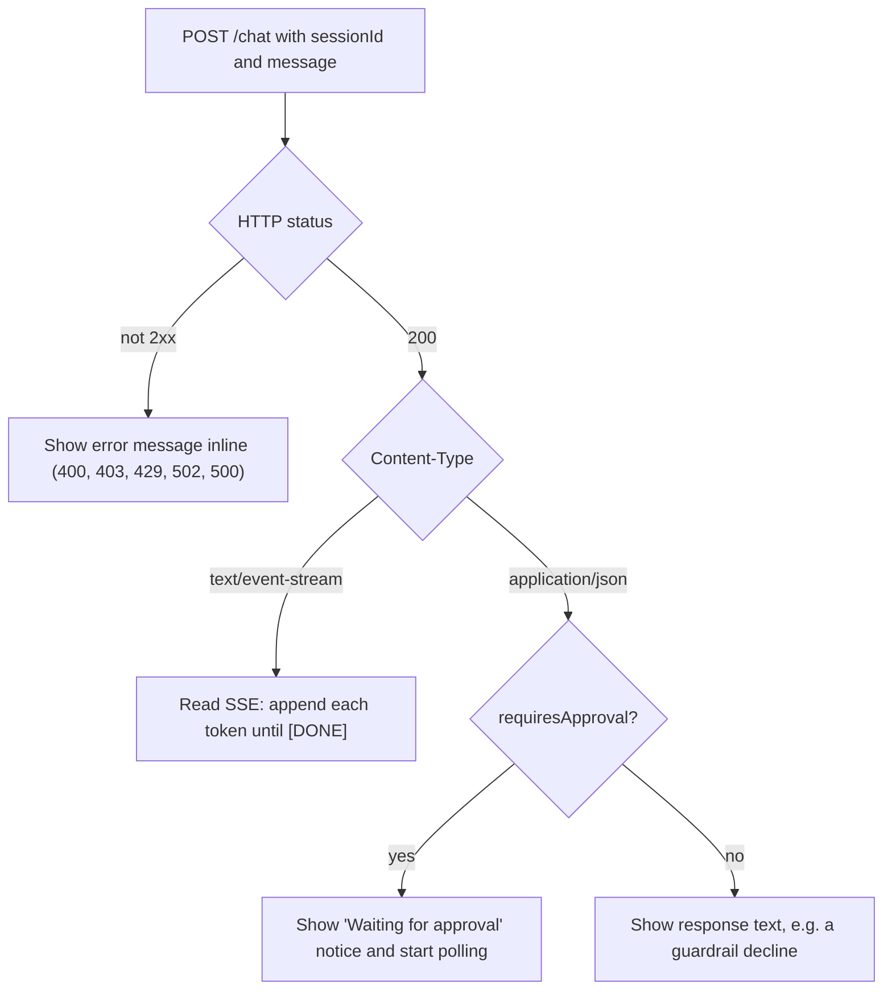
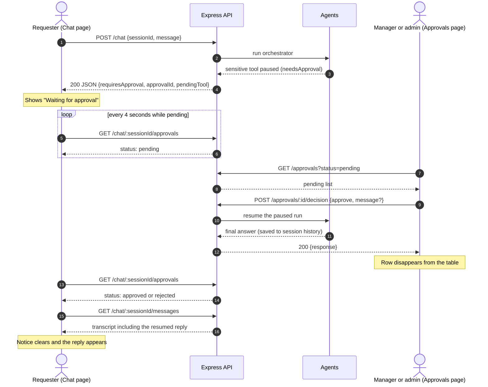
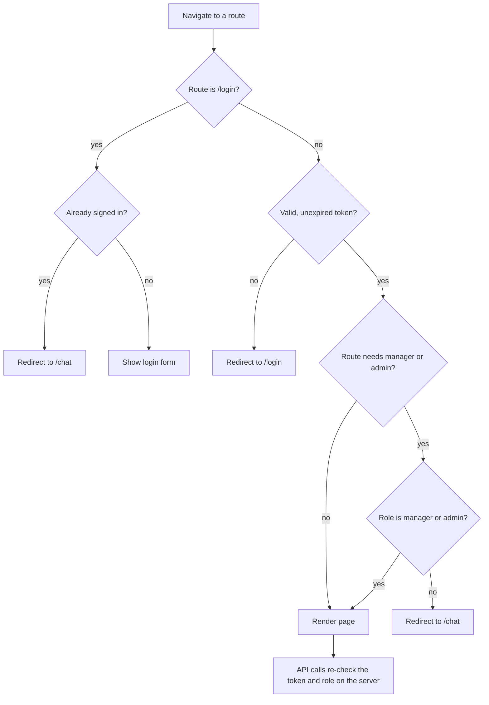

# Employee AI Assistant

An internal chat assistant that answers questions about employees, attendance,
departments, salaries, performance, projects and HR policies (leave, work from
home, expenses, code of conduct). A multi-agent backend (Express + OpenAI
Agents SDK) does the work; this folder is the React frontend.

Company-wide salary data (averages, rankings, ranges, bulk exports) is
restricted: **employees are refused outright**, and **managers and admins have
the request paused for human approval**. The requester sees "Waiting for
approval" in chat, and a manager or admin approves or rejects it from a
dashboard. Approved requests resume automatically and the reply shows up in the
requester's chat.

## Features

- **Sign in** with a username and password (JWT, 1 hour expiry).
- **Chat** with streamed replies and markdown/table rendering.
- **Chat history** in a left sidebar, like ChatGPT and Claude: your past
  conversations grouped by day, click one to reopen it, "New chat" to start
  fresh, and delete from each row's menu. Every conversation has its own URL
  (`/chat/<id>`), so refresh and bookmarks work. On mobile the sidebar is a
  slide-out drawer.
- **Theme**: Light, Dark or System from the toggle in the header (also on the
  login page). Remembered per browser.
- **Approval dashboard** for managers and admins: pending tool calls with
  arguments and request time, Approve / Reject (with optional reason).
- **Role-aware UI**: the Approvals link and route exist only for `manager` and
  `admin`. This is UX only; the server enforces roles on every request.

## Who can do what

| Role       | Chat | Approvals page | Notes                                                        |
| ---------- | ---- | -------------- | ------------------------------------------------------------ |
| `employee` | yes  | no             | Own salary, attendance and performance only; company-wide (or anyone else's) salary, attendance and performance data is refused |
| `manager`  | yes  | yes            | Can approve/reject any paused request                        |
| `admin`    | yes  | yes            | Same as manager for approvals                                |

## How it works

### Architecture



### Chat history

The server already stores every conversation (SQLite `sessions` and `messages`
tables, each session owned by one user). The sidebar reads it through two
owner-only endpoints. Nobody can list, read or delete another user's chats.
Session ids are generated by the client (`crypto.randomUUID()`), and the server
rejects anything that isn't a UUID with a 400, so an id can't be guessed and
pre-claimed.

| Endpoint | Purpose |
| -------- | ------- |
| `GET /chat/sessions` | Your conversations, newest first; the title is the first message |
| `GET /chat/:sessionId/messages` | The transcript of one conversation |
| `DELETE /chat/:sessionId` | Delete a conversation (409 if a request in it is still waiting for approval) |



### What the client does with a chat response

`POST /chat` doesn't always return a stream, so the client branches on the
response type instead of assuming one.



### Approval flow

A manager's or admin's company-wide salary request is paused, a manager or
admin decides it, and the requester's chat picks up the result on its own.
(Employees never get this far: those tools refuse them before any approval is
created.)



If the resumed run hits a second sensitive tool, the decision response is
another `requiresApproval` payload and a new pending row appears.

### Route guard



The client-side checks only shape the UI. Every API call is verified again by
the server, and a 401 anywhere signs the user out.

## How to access it

Once both apps are running locally (see below):

| What                     | URL                             |
| ------------------------ | ------------------------------- |
| Web app                  | http://localhost:5173           |
| API                      | http://localhost:3000           |
| API docs (Swagger UI)    | http://localhost:3000/api-docs  |

Open the web app and sign in. Seed users are in `data/users.csv` at the repo
root; test accounts and what to try with each are in [TESTING.md](TESTING.md).

## Run it locally

### Prerequisites

- **Node.js 22.13 or newer.** The server uses the built-in `node:sqlite`
  module, and Vite 8 needs a recent Node too. Developed on Node 26.
- An **OpenAI API key** (the agents call the OpenAI API).
- **PostgreSQL with the pgvector extension**, used only for the HR-policy
  search. Chat about employees, salaries, etc. does not depend on it, but
  policy questions do.

### 1. Server (`../server`)

Create `server/.env`:

```bash
JWT_SECRET=<any long random string>      # required; server won't start without it
OPENAI_API_KEY=<your key>
DATABASE_URL=postgresql://<user>@localhost:5432/employee_ai_assistant
# optional
PORT=3000                                # default 3000
CLIENT_ORIGIN=http://localhost:5173      # CORS allowlist, comma-separated; default shown
LOG_LEVEL=info
```

Then:

```bash
cd server
npm install
npm run ingest:policies    # one-time: chunk + embed data/policies/*.md into Postgres
npm run dev                # http://localhost:3000
```

`npm run ingest:policies -- --dry-run` previews chunking without calling
OpenAI or the database. The SQLite database for conversations, traces and
approvals is created automatically at `data/app.db`.

### 2. Client (this folder)

```bash
cd client
npm install
npm run dev                # http://localhost:5173
```

Optional: `cp .env.example .env` and set `VITE_API_URL` if the API isn't at
`http://localhost:3000`. If the client runs on a different origin than
`http://localhost:5173`, add that origin to `CLIENT_ORIGIN` on the server.

### Other client commands

```bash
npm run build      # typecheck + production build into dist/
npm run preview    # serve the production build locally
npm run lint       # eslint
```

## How to test it

There is no automated test suite for the client yet. Testing is manual, with a
step-by-step guide in **[TESTING.md](TESTING.md)**: accounts, questions to ask
as each role, the approval flow, and curl checks.

A 2-minute smoke test:

1. Sign in as `manager1` / `manager123`.
2. Ask "In one sentence, what is the annual leave policy?" and watch it stream.
3. Ask "What is the average salary across all employees?" and see **Waiting
   for approval**.
4. Open **Approvals**, click **Approve**, and the row disappears.
5. Go back to **Chat** and the answer is there.
6. Log out from the avatar menu.

Before opening a PR, run `npm run lint && npm run build`.

## Troubleshooting

| Symptom | Likely cause and fix |
| ------- | -------------------- |
| "Cannot reach the server. Is it running?" | Server isn't up, or `VITE_API_URL` points at the wrong place. |
| Browser console shows a CORS error | The client's origin isn't in the server's `CLIENT_ORIGIN`. Add it and restart the server. |
| "Too many login attempts" | Login is limited to 5 attempts per 15 minutes per IP, and wrong passwords count. Wait, or restart the server (the limiter is in memory). |
| "Too many requests" in chat | Chat is limited to 10 messages per minute per user. |
| Signed out unexpectedly | Tokens last 1 hour and there is no refresh; sign in again. |
| Server exits with `JWT_SECRET environment variable is required` | Add `JWT_SECRET` to `server/.env`. |
| Policy questions fail or say they can't verify | Postgres isn't reachable, `DATABASE_URL` is wrong, or `npm run ingest:policies` hasn't been run. |
| A 404 for `/chat/<id>/messages` in the console on a new chat | Expected: a brand-new session has no history yet. |

## Tech stack

React 19 · TypeScript · Vite · Tailwind CSS v4 · shadcn/ui (Base UI) ·
React Router · react-markdown.

## Project layout

```
client/src/
  pages/        login, chat, approvals
  components/   feature components; ui/ is shadcn-generated
  hooks/        useAuth, useChat, useChatSessions, useApprovals, useTheme
  lib/          api.ts (the only place that calls fetch), token storage,
                JWT decoding, role helpers, formatting
  types/        API and domain types mirrored from the server
```

Design notes:

- **Token storage:** the JWT is kept in `localStorage`. The reasoning and its
  trade-offs are documented at the top of `src/lib/auth-storage.ts`.
- **Chat streaming:** the server runs the whole agent first and then replays
  the text as server-sent events, so there is a wait before the first token;
  the skeleton indicator covers it.
- **Conversations live in the URL:** `/chat` is a new conversation and
  `/chat/:sessionId` a saved one, so there is no separate "current session"
  state to keep in sync. A new conversation's id is generated up front and the
  URL switches to it once the server accepts the first message.
- **Theme:** `ThemeProvider` toggles the `dark` class on `<html>`; an inline
  script in `index.html` applies the saved choice before first paint, so
  there's no flash of the wrong theme.
- **Approval updates in chat:** employees can't call `/approvals`, so the chat
  polls `GET /chat/:sessionId/approvals` every 4 seconds while something is
  pending, then reloads the transcript when a decision lands.
- **Role checks:** `src/lib/roles.ts` mirrors the server's
  `requireRole(["manager", "admin"])`. It only decides what to show.
